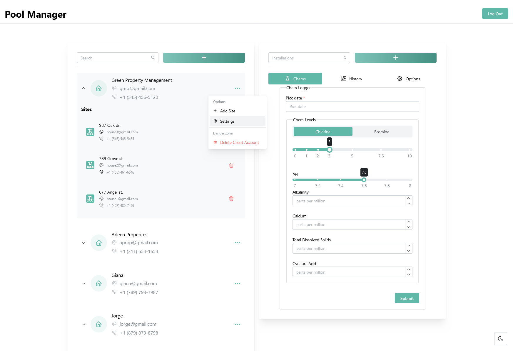
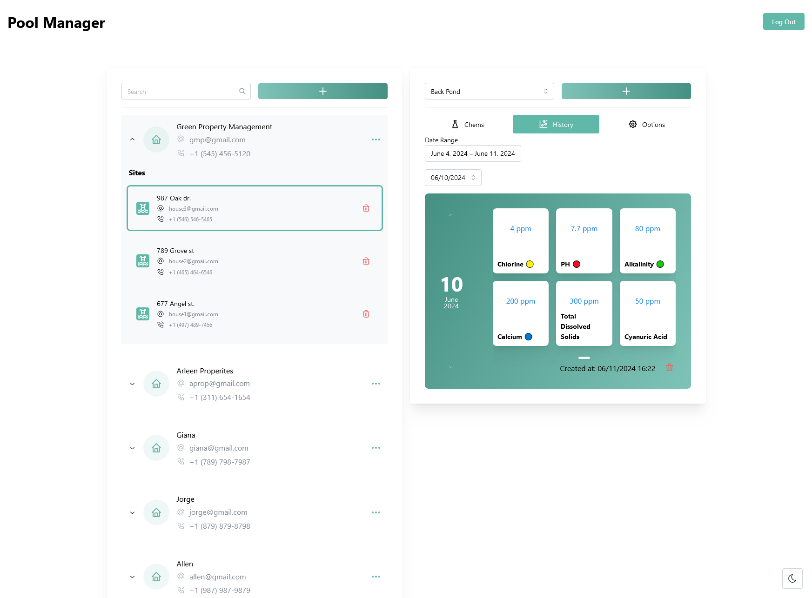
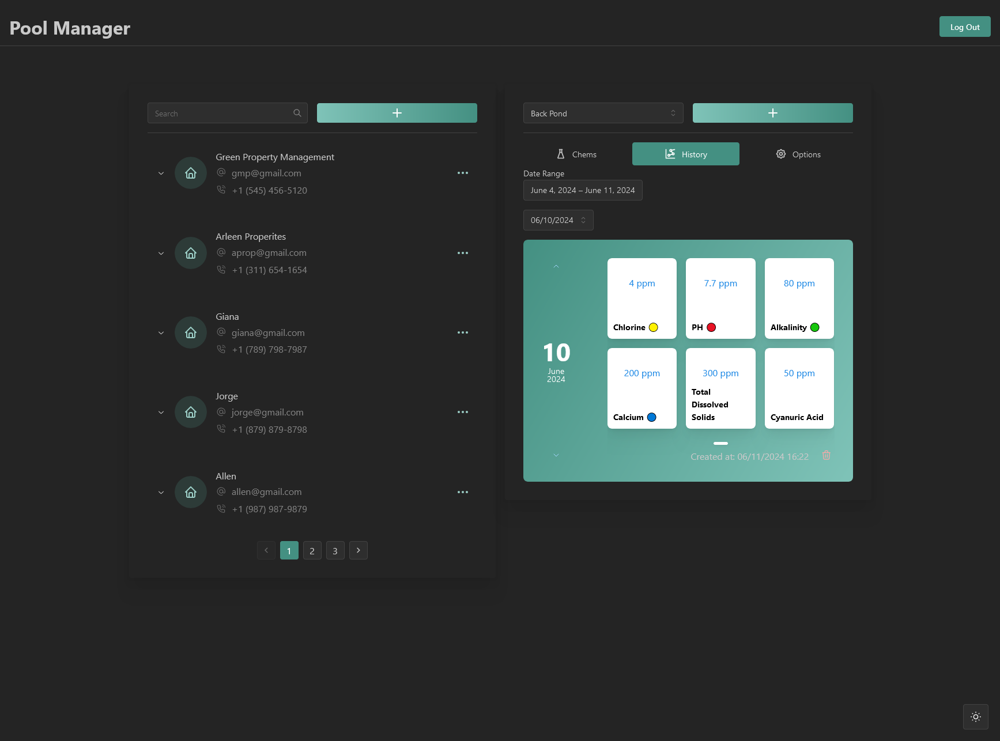
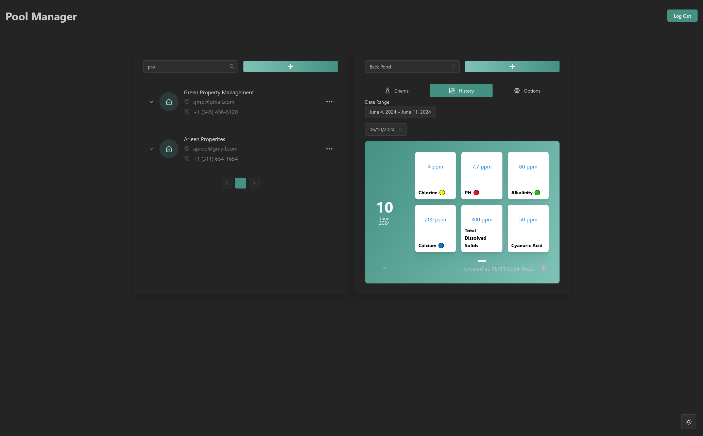
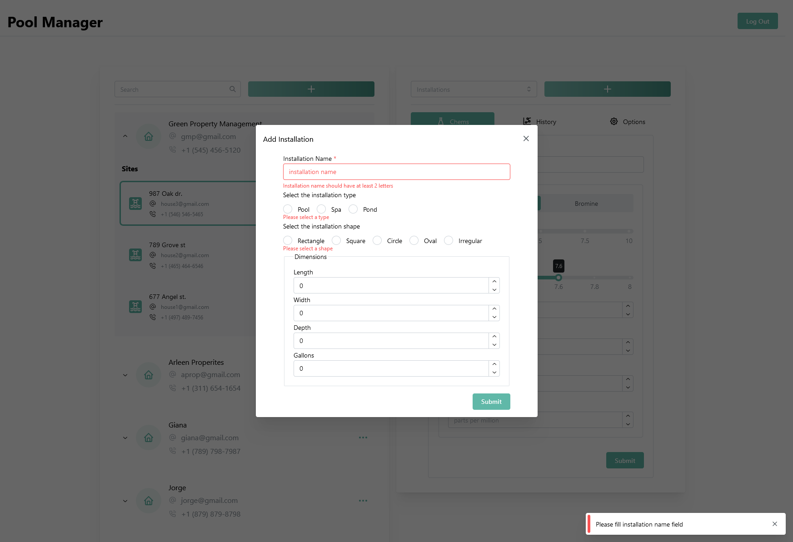

# Pool-Management-App

Pool management app built using REACT and Mantine with CSS modules on the frontend with Auth0 authentication. On the backend I used NodeJS and Express with a PostgreSQL database.

> Pool & Spa maintenance tracker

# Live Version
https://pool-management-app.onrender.com

An app to track chemical levels, repairs, and changes for multiple pools/spas on a professional's route.

## Features
- Add mulitple sites per account

- Add multiple pools/spas to a site
- Log results of water balance testing

- Light/Dark Mode
- 
- Server side search and pagination

- Client and Server side form validation

### Feature Roadmap

- [x] Build frontend for home/login page
       Built a simple landing page using react and tailwind. At the moment it solely exists for users to sign up and log in, may later add a small section detailing features of the app. Once authentication is added users will be able to bypass directly to the dashboard as long as they are authenticated.
- [x] Build frontend for dashboard
      Currently have the skeleton for most features of the dashboard. Adding and deleting accounts with React-query is up and running with form validation client and server side.
- [x] Build out routes and add authentication
      Simple route using React-router implemented to take user from landing page to dashboard. Auth0 is used for authentication.
- [x] Add chemical logging
- [ ] Add user chemical preferences
- [ ] Add notes
- [ ] Add data graphs
- [x] Connect Database
      used pg-promise to connect to Postgres database.
- [ ] Add testing
